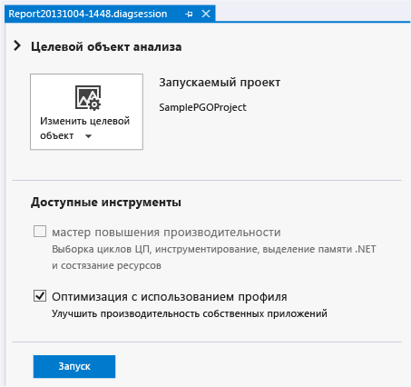
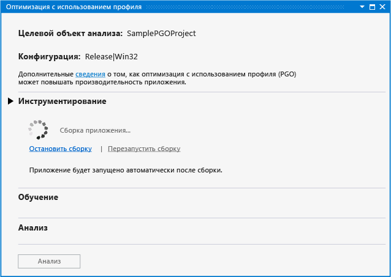
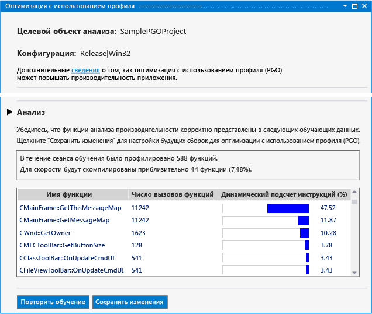
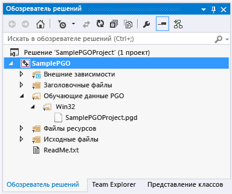

# Профильная оптимизация в концентраторе производительности и диагностики
[!INCLUDE[vs2017banner](../../assembler/inline/includes/vs2017banner.md)]

Профильная оптимизация подключаемого модуля Visual C\+\+ в концентраторе производительности и диагностики ускоряет взаимодействие профильной оптимизации для разработчиков.  Подключаемый модуль можно [скачать](http://go.microsoft.com/fwlink/p/?LinkId=327915) с веб\-сайта Visual Studio.  
  
 Благодаря профильной оптимизации \(PGO\) можно создать сборки x86 и x64 собственные приложения, оптимизированные для способа, которым пользователи взаимодействуют с ними.  Профильная оптимизация — многоступенчатый процесс: сначала выполняется сборка приложения, которое инструментировано для профилирования, а затем проводится "обучение", то есть инструментированное приложение запускается с разными сценариями взаимодействия с пользователем.  Собранные данные профилирования сохраняются, затем происходит перестроение приложения с использованием результатов, которые направят оптимизацию всей программы.  Хотя вы можете выполнить следующие действия по отдельности в Visual Studio или из командной строки, подключаемый модуль профильной оптимизации централизует и упрощает процесс.  Подключаемый модуль профильной оптимизации задает все необходимые параметры, руководит каждым шагом, показывает анализ, а затем использует результаты для настройки сборки, чтобы оптимизировать каждую функцию по размеру и скорости.  Подключаемый модуль профильной оптимизации также упрощает повторное обучение приложения и обновление данных для оптимизации сборки по мере внесения изменений в код.  
  
## Необходимые компоненты  
 Необходимо [загрузить подключаемый модуль профильной оптимизации](http://go.microsoft.com/fwlink/p/?LinkId=327915) и установить его в Visual Studio перед тем, как использовать его в концентраторе производительности и диагностики.  
  
## Пошаговое руководство: Использование подключаемых модулей профильной оптимизации для оптимизации приложения  
 Сначала создайте простое настольное приложение Win32 в Visual Studio.  Если у вас уже есть собственное приложение, которое нужно оптимизировать, то его можно использовать и пропустить этот шаг.  
  
#### Создание приложения  
  
1.  В строке меню выберите **Файл**, **Создать**, **Проект**.  
  
2.  В левой области диалогового окна **Создать проект** разверните **Установленные**, **Шаблоны**, **Visual C\+\+**, затем выберите **Библиотека MFC**.  
  
3.  В центральной области выберите **Приложение MFC**.  
  
4.  Укажите имя проекта — например, SamplePGOProject — в поле **Имя**.  Нажмите кнопку **ОК**.  
  
5.  На странице **Обзор** диалогового окна **Мастер приложений MFC** нажмите кнопку **Готово**.  
  
 Затем задайте конфигурацию сборки приложения в "Выпуск" для подготовки его для действий сборки и обучения профильной оптимизации.  
  
#### Чтобы задать конфигурацию сборки  
  
1.  В строке меню последовательно выберите пункты **Сборка** и **Диспетчер конфигураций**.  
  
2.  В диалоговом окне **Диспетчер конфигураций** выберите разворачивающуюся кнопку **Активная конфигурация решения**, затем выберите **Выпуск**.  Нажмите кнопку **Закрыть**.  
  
 Откройте "Концентратор производительности и диагностики" в строке меню, выберите **Анализ**, **Производительность и диагностика**.  Откроется страница сеанса диагностики со средствами анализа, доступными для данного типа проекта.  
  
   
  
 В разделе **Доступные инструменты** установите флажок **Оптимизация с использованием профиля**.  Выберите кнопку **Запустить**, чтобы запустить подключаемый модуль профильной оптимизации.  
  
   
  
 На странице **Оптимизация с использованием профиля** описаны действия, которые подключаемый модуль предпринимает для повышения производительности приложения.  Нажмите кнопку **Запуск**.  
  
   
  
 В разделе **Инструментирование** можно выбрать параметр **Обучение изначально включено**, чтобы выбрать, включать ли точку запуска приложения как часть обучения.  Если этот параметр не установлен, данные обучения не записываются в запущенное инструментированное приложение, пока обучение не будет явно включено.  
  
 Нажмите кнопку **Инструментировать**, чтобы выполнить сборку приложения со специальным набором параметров компилятора.  Компилятор вставляет инструкции зонда в созданный код.  Эти инструкции записывают данные профилирования на этапе обучения.  
  
   
  
 По завершению сборки инструментированного приложения оно запускается автоматически.  
  
 Если во время сборки возникли какие\-либо ошибки или предупреждения, исправьте их, а затем выберите команду **Перезапуск сборки**, чтобы перезапустить инструментированную сборку.  
  
 Когда приложение запустится, можно использовать ссылки **Начать обучение** и **Приостановить обучение** в разделе **Обучение**, чтобы управлять записью информации профилирования.  Вы можете использовать ссылки **Остановить приложение** и **Запустить приложение**, чтобы остановить и перезапустить приложение.  
  
   
  
 Во время обучения просматривайте сценарии пользователя сбора, чтобы захватить данные профилирования, которые нужны подключаемому модулю профильной оптимизации для оптимизации кода.  После завершения обучения закройте приложение или выберите ссылку **Остановить приложение**.  Нажмите кнопку **Анализ**, чтобы запустить шаг анализа.  
  
 Когда анализ завершен, в области **Анализ** отображается отчет данных профилирования, которые были зафиксированы на этапе обучения пользовательским сценариям.  Этот отчет можно использовать для исследования того, какие функции приложения были вызваны чаще всех и на какие из них было потрачено больше времени.  Подключаемый модуль профильной оптимизации использует эти сведения, чтобы определить, какие функции приложения требуют оптимизации быстродействия, а какие — оптимизации по размеру.  Подключаемый модуль профильной оптимизации настраивает оптимизации сборки для создания наименьшего, наиболее быстрого приложения для сценариев пользователя, записанных в ходе обучения.  
  
   
  
 Если обучение зафиксировало ожидаемые данные профилирования, можно выбрать **Сохранить изменения** для сохранения в проекте проанализированных данных профилирования, чтобы оптимизировать последующие сборки.  Чтобы отменить данные профилирования и начать обучение с самого начала, выберите **Повторить обучение**.  
  
 Файл данных профилирования сохраняется в проекте в папке **PGO Training Data**.  Эти данные используются для управления параметрами компилятора по оптимизации сборки в приложении.  
  
   
  
 После анализа, подключаемый модуль профильной оптимизации настраивает параметры сборки в проекте так, чтобы использовать данные профилирования для выборочной оптимизации приложения во время компиляции.  Можно продолжить изменение и выполнение сборки приложения с теми же данными профилирования.  После сборки приложения в выходных данных сборки сообщается, сколько функций и инструкций было оптимизировано с использованием данных профилирования.  
  
   
  
 Если во время разработки выполняется значительное изменение кода, вы можете повторить обучение, чтобы получить лучшие показатели оптимизации приложения.  Рекомендуется повторить обучение приложения, если в выходных данных сборки сообщается, что с помощью данных профилирования было оптимизировано менее 80 процентов функций и инструкций.