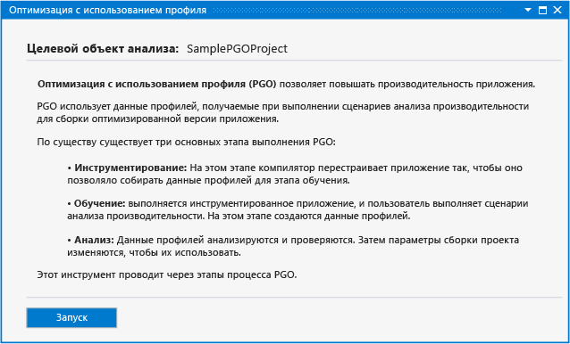
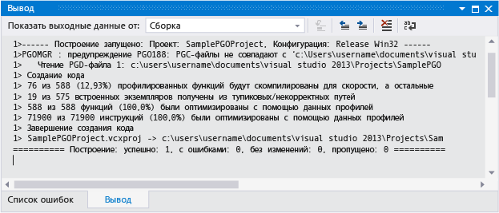

# Профильная оптимизация в концентраторе производительности и диагностики
Профильная оптимизация подключаемого модуля Visual C++ в концентраторе производительности и диагностики ускоряет взаимодействие профильной оптимизации для разработчиков. Вы можете [загрузить подключаемый модуль](http://go.microsoft.com/fwlink/p/?LinkId=327915) с веб-сайта Visual Studio.  
  
 Благодаря профильной оптимизации (PGO) можно создать сборки x86 и x64 собственные приложения, оптимизированные для способа, которым пользователи взаимодействуют с ними. Профильная оптимизация — многоступенчатый процесс: сначала выполняется сборка приложения, которое инструментировано для профилирования, а затем проводится "обучение", то есть инструментированное приложение запускается с разными сценариями взаимодействия с пользователем. Собранные данные профилирования сохраняются, затем происходит перестроение приложения с использованием результатов, которые направят оптимизацию всей программы. Хотя вы можете выполнить следующие действия по отдельности в Visual Studio или из командной строки, подключаемый модуль профильной оптимизации централизует и упрощает процесс. Подключаемый модуль профильной оптимизации задает все необходимые параметры, руководит каждым шагом, показывает анализ, а затем использует результаты для настройки сборки, чтобы оптимизировать каждую функцию по размеру и скорости. Подключаемый модуль профильной оптимизации также упрощает повторное обучение приложения и обновление данных для оптимизации сборки по мере внесения изменений в код.  
  
## Предварительные требования  
 Вы должны [загрузить подключаемый модуль профильной Оптимизации](http://go.microsoft.com/fwlink/p/?LinkId=327915) и установите его в Visual Studio, прежде чем можно будет использовать в концентраторе производительности и диагностики.  
  
## Пошаговое руководство: Использование подключаемых модулей профильной оптимизации для оптимизации приложения  
 Сначала создайте простое настольное приложение Win32 в Visual Studio. Если у вас уже есть собственное приложение, которое нужно оптимизировать, то его можно использовать и пропустить этот шаг.  
  
#### Создание приложения  
  
1.  В строке меню выберите **Файл**, **Создать**, **Проект**.  
  
2.  В левой области **новый проект** диалоговое окно разверните **установленные**, **шаблоны**, **Visual C++**, а затем выберите  **MFC**.  
  
3.  В центральной области выберите **приложение MFC**.  
  
4.  Укажите имя для проекта — например, **SamplePGOProject**— в **имя** поле. Нажмите кнопку **ОК** .  
  
5.  На **Обзор** страница **мастер приложений MFC** диалогового окна выберите **Готово** кнопки.  
  
 Затем задайте конфигурацию сборки приложения в "Выпуск" для подготовки его для действий сборки и обучения профильной оптимизации.  
  
#### Чтобы задать конфигурацию сборки  
  
1.  В строке меню последовательно выберите пункты **Сборка**и **Диспетчер конфигураций**.  
  
2.  В **Configuration Manager** диалогового окна выберите **активная конфигурация решения** кнопку раскрывающегося списка и выберите **выпуска**. Выберите **закрыть** кнопки.  
  
 Откройте в концентраторе производительности и диагностики, в строке меню выберите **анализ**, **производительность и диагностика**. Откроется страница сеанса диагностики со средствами анализа, доступными для данного типа проекта.  
  
   
  
 В **доступные инструменты**выберите **профильной оптимизации** флажок. Выберите **запустить** кнопку, чтобы запустить подключаемый модуль профильной Оптимизации.  
  
   
  
 **Профильной оптимизации** страница описывает шаги подключаемого модуля используется для повышения производительности приложения. Выберите **запустить** кнопки.  
  
   
  
 В **инструментария** можно выбрать **обучение изначально включено** возможность выбирать, включать ли точку запуска приложения как часть обучения. Если этот параметр не установлен, данные обучения не записываются в запущенное инструментированное приложение, пока обучение не будет явно включено.  
  
 Выберите **инструмент** , чтобы построить приложение с особым набором параметров компилятора. Компилятор вставляет инструкции зонда в созданный код. Эти инструкции записывают данные профилирования на этапе обучения.  
  
   
  
 По завершению сборки инструментированного приложения оно запускается автоматически.  
  
 Если во время построения возникают ошибки или предупреждения, исправьте их и нажмите кнопку **перезапуск сборки** перезапустить инструментированную сборку.  
  
 При запуске приложения можно использовать **начать обучение** и **приостановить Обучение** связывает **обучения** Чтобы управлять записью информации профилирования. Можно использовать **остановить приложение** и **запуск приложения** ссылки, чтобы остановить и перезапустить приложение.  
  
   
  
 Во время обучения просматривайте сценарии пользователя сбора, чтобы захватить данные профилирования, которые нужны подключаемому модулю профильной оптимизации для оптимизации кода. После завершения обучения закройте приложение или выберите **остановить приложение** ссылку. Выберите **анализ** кнопку, чтобы запустить шаг анализа.  
  
 После завершения анализа **Analysis** отображается отчет данных профилирования, полученной на этапе обучения пользовательским сценариям. Этот отчет можно использовать для исследования того, какие функции приложения были вызваны чаще всех и на какие из них было потрачено больше времени. Подключаемый модуль профильной оптимизации использует эти сведения, чтобы определить, какие функции приложения требуют оптимизации быстродействия, а какие — оптимизации по размеру. Подключаемый модуль профильной оптимизации настраивает оптимизации сборки для создания наименьшего, наиболее быстрого приложения для сценариев пользователя, записанных в ходе обучения.  
  
   
  
 Если обучение зафиксировало ожидаемые данные профилирования, вы можете **сохранить изменения** сохранение проанализированных данных профилирования в проекте, чтобы оптимизировать последующие сборки. Чтобы отменить данные профилирования и начать обучение с с самого начала, выберите **повторить Обучение**.  
  
 Файл данных профилирования сохраняется в проекте в **PGO Training Data** папки. Эти данные используются для управления параметрами компилятора по оптимизации сборки в приложении.  
  
   
  
 После анализа, подключаемый модуль профильной оптимизации настраивает параметры сборки в проекте так, чтобы использовать данные профилирования для выборочной оптимизации приложения во время компиляции. Можно продолжить изменение и выполнение сборки приложения с теми же данными профилирования. После сборки приложения в выходных данных сборки сообщается, сколько функций и инструкций было оптимизировано с использованием данных профилирования.  
  
   
  
 Если во время разработки выполняется значительное изменение кода, вы можете повторить обучение, чтобы получить лучшие показатели оптимизации приложения. Рекомендуется повторить обучение приложения, если в выходных данных сборки сообщается, что с помощью данных профилирования было оптимизировано менее 80 процентов функций и инструкций.