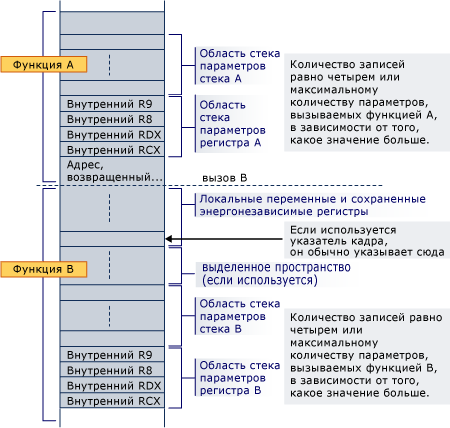

# Выделение памяти в стеке
В прологе функции несет ответственность за выделение памяти в стеке для локальных переменных, сохраняемые регистры, параметров стека и регистра.  
  
 Область параметров всегда находится в нижней части стека (даже если используется функция alloca), чтобы он всегда будет рядом обратный адрес при вызове функции. Он содержит по крайней мере четыре записи, но всегда требуется достаточно места для хранения всех параметров любой функцией, которая может быть вызван. Обратите внимание, что память выделяется всегда для параметров регистра, даже если самих параметров они никогда не размещаются в стеке. Вызываемый объект гарантируется, что места, выделенного для всех параметров. Домашние адреса необходимы для аргументов регистра, поэтому непрерывную область доступна, если необходимо получить адрес списка аргументов (va_list) или отдельного аргумента вызываемой функции. В этой области также предоставляет удобное место для сохранения аргументы регистров во время выполнения преобразователя и как средство отладки (например, он делает аргументы легко найти во время отладки, если они хранятся в их домашние адреса кода пролога). Даже если вызываемая функция принимает менее четырех параметров, четыре ячейки стека эффективно принадлежат вызванной функции и может использоваться для других целей, помимо хранения значений регистра параметров вызываемой функцией.  Поэтому вызывающая сторона не может сохранять данные в этой области стека во время вызова функции.  
  
 Если пространство динамически выделяется в функции (alloca), затем защищенный регистр необходимо использовать в качестве указателя фрейма помечается основание фиксированной части стека и регистра должен быть сохранен и инициализировать в прологе. Обратите внимание, что при использовании alloca вызовов одной вызываемому из одного вызывающего объекта может различные домашние адреса для параметров регистра.  
  
 Стек всегда будут сохраняться 16-байтовое выравнивание, за исключением пролога (например, после возвращаемого адреса) и случаев, определенных в [типы функций](../build/function-types.md) для конкретных классов или функций кадра.  
  
 Далее приведен пример макета стека, где функция A вызывает неконечных функцию в прологе функции B. A уже выделена память для всех параметров регистра и стека предусмотренного В нижней части стека. Вызов помещает обратный адрес и B в прологе выделяет место для ее локальных переменных, неизменяемые регистры и места, необходимого для вызова функции. Если B использует alloca, память выделяется между локальных переменных или защищенного регистра областью для хранения и параметра области стека.  
  
   
  
 Когда функция B вызывает другую функцию, обратный адрес помещается непосредственно под домашний адрес для RCX.  
  
## См. также  
 [Использование стека](../build/stack-usage.md)