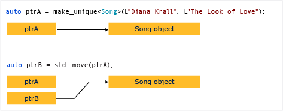

# Практическое руководство. Создание и использование экземпляров unique_ptr
[!INCLUDE[vs2017banner](../assembler/inline/includes/vs2017banner.md)]

[unique\_ptr](../standard-library/unique-ptr-class.md) не предоставляет общий доступ к своему указателю.  Его невозможно скопировать в другой `unique_ptr`, передать по значению функции или использовать в любом алгоритме стандартной библиотеки шаблонов \(STL\), предполагающем создание копий.  `unique_ptr` можно только переместить.  Это означает, что владение ресурсов памяти переносится в другое `unique_ptr` и оригинал `unique_ptr` больше им не владеет.  Рекомендуется ограничить объект одним владельцем, поскольку множественное владение усложняет логику программы.  Поэтому при необходимости интеллектуального указателя для простого объекта C\+\+ используйте `unique_ptr` и при построении `unique_ptr` используйте вспомогательную функцию [make\_unique](../Topic/make_unique.md).  
  
 Следующая схема иллюстрирует передачу прав собственности между двумя экземплярами `unique_ptr`.  
  
   
  
 `unique_ptr` определяется в заголовке `<memory>` в STL.  Он так же эффективен, как и необработанный указатель, и может использоваться в контейнерах STL.  Добавление экземпляров `unique_ptr` к контейнерам STL эффективно, так как конструктор `unique_ptr` исключает необходимость перемещения для копирования.  
  
## Пример  
 В следующем примере описывается порядок создания экземпляров `unique_ptr` и передачи их между функциями.  
  
 [!code-cpp[stl_smart_pointers#210](../cpp/codesnippet/CPP/how-to-create-and-use-unique-ptr-instances_1.cpp)]  
  
 В этих примерах демонстрируется эта базовая характеристика `unique_ptr`: ее можно изменить, но не для копирования. "Перемещение" перемещает владельца в новый `unique_ptr` и сбрасывает старый `unique_ptr`.  
  
## Пример  
 В следующем примере описывается порядок создания экземпляров `unique_ptr` и их использования в векторе.  
  
 [!code-cpp[stl_smart_pointers#211](../cpp/codesnippet/CPP/how-to-create-and-use-unique-ptr-instances_2.cpp)]  
  
 Обратите внимание, что в диапазоне для цикла `unique_ptr` передается по ссылке.  При попытке передачи по значению компилятор выдаст ошибку, поскольку конструктор копирования `unique_ptr` удален.  
  
## Пример  
 В следующем примере показана инициализация `unique_ptr`, являющегося членом класса.  
  
 [!code-cpp[stl_smart_pointers#212](../cpp/codesnippet/CPP/how-to-create-and-use-unique-ptr-instances_3.cpp)]  
  
## Пример  
 Функцию [make\_unique](../Topic/make_unique.md) можно использовать для создания `unique_ptr` в массиве, но невозможно использовать `make_unique` для инициализации элементов массива.  
  
 [!code-cpp[stl_smart_pointers#213](../cpp/codesnippet/CPP/how-to-create-and-use-unique-ptr-instances_4.cpp)]  
  
 Дополнительные примеры см. в разделе [make\_unique](../Topic/make_unique.md).  
  
## См. также  
 [Интеллектуальные указатели](../cpp/smart-pointers-modern-cpp.md)   
 [make\_unique](../Topic/make_unique.md)