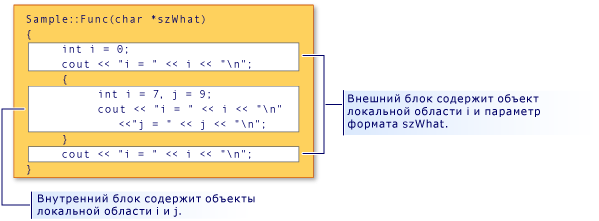

# Область (Visual C++)
[!INCLUDE[vs2017banner](../assembler/inline/includes/vs2017banner.md)]

Имена C\+\+ можно использовать только в некоторых областях программы.  Эта область называется областью видимости имени.  Область видимости определяет время существования имени, которое не обозначает статический объект.  Область также определяет видимость имени, когда вызываются конструкторы и деструкторы классов и когда инициализируются переменные, являющиеся локальными для данной области видимости.  \(Дополнительные сведения см. в разделах [Конструкторы](../cpp/constructors-cpp.md) и [Деструкторы](../cpp/destructors-cpp.md).\) Существует пять типов области видимости.  
  
-   **Локальная область** Имя, объявленное в блоке, доступно только в этом блоке и вложенных в него блоках и только после объявления.  Имена формальных аргументов функции в области внешнего блока функции имеют локальную область видимости, как если бы они были объявлены внутри блока, включающего тело функции.  Рассмотрим следующий фрагмент кода:  
  
    ```  
    {  
        int i;  
    }  
    ```  
  
     Поскольку объявление `i` находится в блоке, заключенном в фигурные скобки, `i` имеет локальную область и никогда не доступно, потому что никакой код не осуществляет доступ к нему до закрытия фигурной скобки.  
  
-   **Область функций** Метки — это единственные имена, имеющие область функции.  Их можно использовать в любом месте функции, однако они недоступны за пределами этой функции.  Формальные аргументы функции \(то есть заданные в ее определении\) находятся в области видимости самого внешнего блока тела функции.  
  
-   **Область файлов** Любое имя, объявленное за пределами всех блоков или классов, имеет область файлов.  Она доступна в любом месте записи преобразования после объявления.  Имена с областью файлов, не объявляющие статические объекты, часто называются глобальными именами.  
  
     В C\+\+ область файлов также известна как область пространства имен.  
  
-   **Область классов** Имена членов класса имеют область видимости "класс".  Функции\-члена класса доступны только с помощью операторов выбора элементов \(**.** или **–\>**\) или операторов указателей на элементы \(**.\*** или **–\>\***\) для объекта или указателя на объект этого класса; данные о нестатических членах классов считаются локальными по отношению к объекту этого класса.  Рассмотрим следующее объявление класса.  
  
    ```  
    class Point  
    {  
        int x;  
        int y;  
    };  
    ```  
  
     Считается, что члены класса `x` и `y` находятся в области класса `Point`.  
  
-   **Область прототипов** Имена, объявленные в прототипе функции, видны только до конца прототипа.  Следующий прототип объявляет три имя \(`strDestination`, `numberOfElements` и `strSource`\); эти имена находятся вне области в конце прототипа.  
  
    ```  
    errno_t strcpy_s( char *strDestination, size_t numberOfElements, const char *strSource );  
    ```  
  
## Скрытие имен  
 Можно скрыть имя, объявив его в закрытом блоке.  На следующем рисунке `i` повторно объявляется во внутреннем блоке, таким образом скрывая переменную, связанную с `i` во внешней области видимости блока.  
  
   
Область видимости блока и скрытие имен  
  
 Выходные данные программы, представленной на рисунке, выглядят следующим образом.  
  
```  
i = 0  
i = 7  
j = 9  
i = 0  
```  
  
> [!NOTE]
>  Считается, что аргумент `szWhat`, находится в области видимости функции.  Поэтому он обрабатывается так, как если бы он был объявлен в крайнем блоке функции.  
  
## Скрытие имен классов  
 Имена классов можно скрыть, объявив функцию, объект, переменную или перечислитель в той же области.  Однако доступ к имени класса можно по\-прежнему получить, если перед ним стоит ключевое слово **class**.  
  
```  
// hiding_class_names.cpp  
// compile with: /EHsc  
#include <iostream>  
using namespace std;  
  
// Declare class Account at file scope.  
class Account  
{  
public:  
    Account( double InitialBalance )  
        { balance = InitialBalance; }  
    double GetBalance()  
        { return balance; }  
private:  
    double balance;  
};  
  
double Account = 15.37;            // Hides class name Account  
  
int main()  
{  
    class Account Checking( Account ); // Qualifies Account as   
                                       //  class name  
  
    cout << "Opening account with balance of: "  
         << Checking.GetBalance() << "\n";  
}  
//Output: Opening account with balance of: 15.37  
```  
  
> [!NOTE]
>  В любом месте вызова имени класса \(`Account`\) необходимо использовать ключевое слово class, чтобы отличить его от переменной Account, видимой в пределах файла.  Это правило не применяется, если имя класса находится слева от оператора разрешения области действия \(::\).  Имена слева от оператора разрешения области действия всегда считаются именами класса.  
  
 В следующем примере показано, как объявить указатель на объект типа `Account` с помощью ключевого слова **class**.  
  
```  
class Account *Checking = new class Account( Account );  
```  
  
 `Account` в инициализаторе \(в скобках\) в указанном выше операторе имеет область видимости файла; она принадлежит типу **double**.  
  
> [!NOTE]
>  Повторное использование имен идентификаторов считается плохим стилем программирования, как показано в следующем примере.  
  
 Дополнительные сведения об указателях см. в разделе [Производные типы](http://msdn.microsoft.com/ru-ru/aa14183c-02fe-4d81-95fe-beddb0c01c7c).  Дополнительные сведения об объявлении и инициализации объектов классов см. в разделе [Классы, структуры и объединения](../Topic/Classes%20and%20Structs%20\(C++\).md).  Дополнительные сведения об использовании операторов свободного хранилища **new** и **delete** см. в разделе [Специальные функции\-члены](../misc/special-member-functions-cpp.md).  
  
## Скрытие имен в области видимости файла  
 Имена с областью видимости файла можно скрыть, явно объявив одно и то же имя в области видимости блока.  Однако доступ к именам области видимости файла можно получить с помощью оператора разрешения области действия \(`::`\).  
  
```  
// file_scopes.cpp  
// compile with: /EHsc  
#include <iostream>  
  
int i = 7;   // i has file scope, outside all blocks  
using namespace std;  
  
int main( int argc, char *argv[] ) {  
   int i = 5;   // i has block scope, hides i at file scope  
   cout << "Block-scoped i has the value: " << i << "\n";  
   cout << "File-scoped i has the value: " << ::i << "\n";  
}  
```  
  
  **Переменная i, видимая в пределах блока, имеет значение 5.**  
**Переменная i, видимая в пределах файла, имеет значение 7.**   
## См. также  
 [Основные понятия](../cpp/basic-concepts-cpp.md)