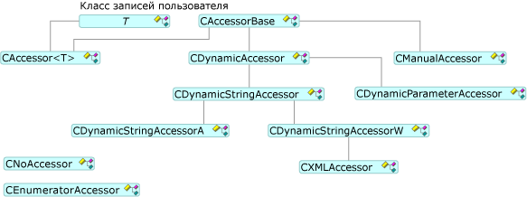

# Методы доступа и наборы строк
Для установки и извлечения данных, шаблоны OLE DB используют метод доступа и набор строк с помощью [CAccessorRowset](../../data/oledb/caccessorrowset-class.md) класса. Этот класс может обрабатывать несколько методов доступа к разным типам.  
  
## Типы методов доступа  
 Все методы доступа являются производными от [CAccessorBase](../../data/oledb/caccessorbase-class.md). `CAccessorBase` предоставляет параметр и привязка к столбцу.  
  
 На следующем рисунке показана типы методов доступа.  
  
   
Классы методов доступа  
  
-   [CAccessor](../../data/oledb/caccessor-class.md) используйте этот метод доступа, если известно структуры источника базы данных во время разработки. `CAccessor` статически связывает запись базы данных, которая содержит буфер, к источнику данных.  
  
-   [CDynamicAccessor](../../data/oledb/cdynamicaccessor-class.md) используйте этот метод доступа, если вы не знаете структуры базы данных во время разработки. `CDynamicAccessor` вызовы `IColumnsInfo::GetColumnInfo` Чтобы получить сведения о столбцах базы данных. Создает и управляет методом доступа и буфером.  
  
-   [CDynamicParameterAccessor](../../data/oledb/cdynamicparameteraccessor-class.md) использовать этот метод доступа для обработки типов Неизвестная команда. При подготовке команд `CDynamicParameterAccessor` можно получить сведения о параметрах из `ICommandWithParameters` интерфейс, если поставщик поддерживает `ICommandWithParameters`.  
  
-   [CDynamicStringAccessor](../../data/oledb/cdynamicstringaccessor-class.md), [CDynamicStringAccessorA](../../data/oledb/cdynamicstringaccessora-class.md), и [CDynamicStringAccessorW](../../data/oledb/cdynamicstringaccessorw-class.md) эти классы используются, если у вас нет сведений о схеме базы данных. `CDynamicStringAccessorA` Получает данные в виде строк ANSI; `CDynamicStringAccessorW` получает данные в виде строки в Юникоде.  
  
-   [CManualAccessor](../../data/oledb/cmanualaccessor-class.md) с этим классом, можно использовать любые типы данных, если поставщик может преобразовать типы. Он обрабатывает результирующих столбцов и параметров команды.  
  
 В следующей таблице перечислены поддержка в типы методов доступа шаблонов OLE DB.  
  
|Тип метода доступа|Динамический|Обрабатывает параметры|Буфер|Несколько методов доступа|  
|-------------------|-------------|--------------------|------------|------------------------|  
|`CAccessor`|Нет|Да|Пользовательская|Да|  
|`CDynamicAccessor`|Да|Нет|Шаблоны OLE DB|Нет|  
|`CDynamicParameterAccessor`|Да|Да|Шаблоны OLE DB|Нет|  
|`CDynamicStringAccessor[A,W]`|Да|Нет|Шаблоны OLE DB|Нет|  
|`CManualAccessor`|Да|Да|Пользовательская|Да|  
  
## Типы наборов строк  
 Шаблоны OLE DB поддерживают три вида набора строк (см. предыдущий рисунок): один набор строк (реализован [CRowset](../../data/oledb/crowset-class.md)), групповой набор строк (реализован [CBulkRowset](../../data/oledb/cbulkrowset-class.md)) и массивный (реализован по [CArrayRowset](../../data/oledb/carrayrowset-class.md)). Одиночный набор строк загружает дескриптор одной строки при `MoveNext` вызывается. Набор строк пакета можно загрузить дескриптор нескольких строк. Набор строк массива являются наборы строк, которые могут быть доступны с помощью синтаксис массива.  
  
 На следующем рисунке показана типы наборов строк.  
  
   
Классы набора строк  
  
 [Наборы строк схемы](../../data/oledb/obtaining-metadata-with-schema-rowsets.md) сделать не доступа в данных хранилища данных, но вместо этого доступ к сведениям о хранилище данных, называемые метаданными. Наборы строк схемы обычно используются в ситуациях, в которых структура базы данных не известна во время компиляции и должны быть получены во время выполнения.  
  
## См. также  
 [Шаблоны потребителя OLE DB](../../data/oledb/ole-db-consumer-templates-cpp.md)