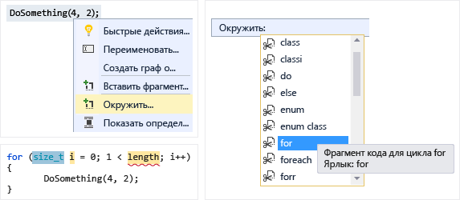
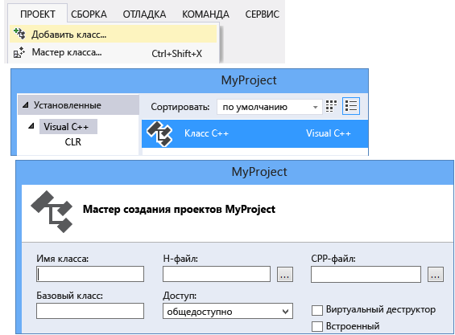
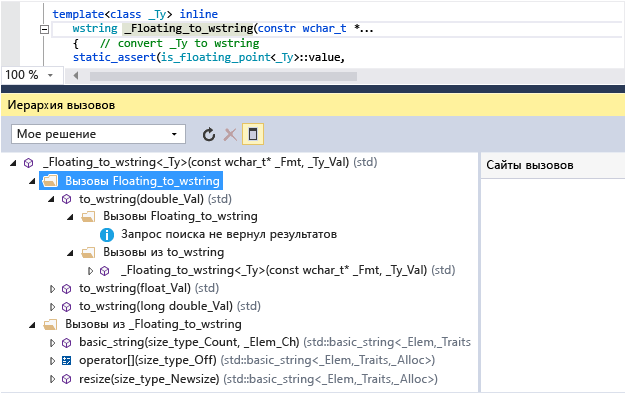
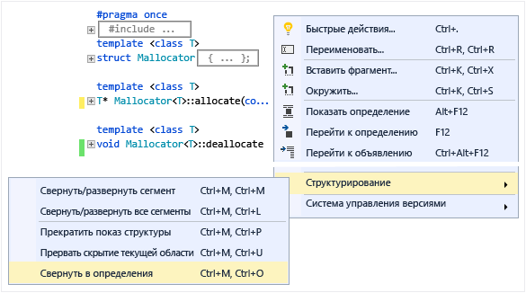
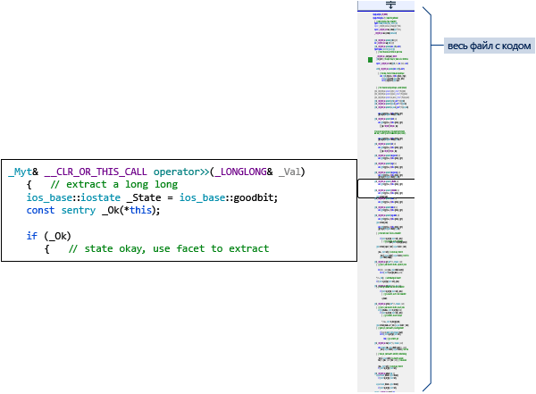

# Написание и рефакторинг кода (C++)

Редактор кода Visual C++ и IDE предоставляют различные вспомогательные средства кодирования. Одни уникальны для C++, а другие фактически одинаковы для всех языков Visual Studio. Дополнительные сведения об общих функциях см. в разделе [написание кода в редакторе кода и текста](/visualstudio/ide/writing-code-in-the-code-and-text-editor). Параметры для включения и настройки функции C++ находятся в [текстовый редактор, C++, Дополнительно](/visualstudio/ide/reference/options-text-editor-c-cpp-advanced) диалогового окна (**средства &#124; параметры &#124; текстовый редактор &#124; C/C++ &#124; Дополнительно** или введите «C++ Дополнительно» в **быстрого запуска**). После выбора параметра, который нужно задать, чтобы получить дополнительную справку, нажав клавишу **F1** Если диалоговое окно находится в фокусе. Для общих параметров форматирования кода введите `Editor C++` в **быстрого запуска**.

Экспериментальные функции, которые могут или не могут быть включены в будущих версиях Visual Studio, можно найти на [текстовый редактор C++ экспериментальный](/visualstudio/ide/reference/options-text-editor-c-cpp-experimental) диалогового окна. В Visual Studio 2017 г. Вы можете включить **прогнозной Intellisense** в этом диалоговом окне.

## Добавление нового кода

После создания проекта можно начать кодирование в созданных файлах. Чтобы добавить новые файлы, щелкните правой кнопкой мыши узел проекта в обозревателе решений и выберите **добавить &#124; New**.

Для задания параметров форматирования, например отступы, завершение скобок и раскраску, введите `C++ Formatting` в **быстрого запуска** окна.

### IntelliSense

IntelliSense — это название набора возможностей, предоставляющих встроенные сведения о членах, типах и перегрузке возможностей. На следующем рисунке показан раскрывающийся список членов, отображаемый при вводе данных на клавиатуре. Для ввода выбранного текста элемента в файл кода можно нажать клавишу TAB.

Дополнительные сведения в разделе [Intellisense для Visual C++](/visualstudio/ide/visual-cpp-intellisense).

### Вставка фрагментов

Фрагмент — это предварительно определенная часть исходного кода. Щелкните правой кнопкой мыши одну точку или выбранный текст для вставки фрагмента или размещения выбранного текста внутри фрагмента. На следующем рисунке показана процедура размещения выбранного оператора в цикле for. На последнем изображении желтым цветом выделены редактируемые поля, доступ к которым осуществляется с помощью клавиши TAB. Дополнительные сведения см. в статье [Фрагменты кода](/visualstudio/ide/code-snippets).

### Добавить класс

Добавьте новый класс из **проекта** меню с помощью мастера классов.

### Мастер классов

Изменение или проверка существующего класса либо добавление нового класса с помощью мастера классов. Дополнительные сведения см. в разделе [Добавление функциональных возможностей с помощью мастеров кода (C++)](../ide/adding-functionality-with-code-wizards-cpp.md).

## Рефакторинг

Рефакторинг доступны в контекстном меню быстрое действие или щелкнув [лампочки](/visualstudio/ide/perform-quick-actions-with-light-bulbs) в редакторе.  Некоторые находятся в **Правка > рефакторинг** меню.  Эти функции включают перечисленные ниже.

* [Переименование](refactoring/rename.md)
* [Извлечение функции](refactoring/extract-function.md)
* [Реализация чистых виртуальных функций](refactoring/implement-pure-virtuals.md)
* [Создание объявления или определения](refactoring/create-declaration-definition.md)
* [Перемещение определения функции](refactoring/move-definition-location.md)
* [Преобразование в необработанный строковый литерал](refactoring/convert-to-raw-string-literal.md)
* [Изменение сигнатуры](refactoring/change-signature.md)

## Перейти и понять

Visual C++ использует многие возможности навигации кода с другими языками. Дополнительные сведения см. в разделе [перемещение по коду](/visualstudio/ide/navigating-code) и [Просмотр структуры кода](/visualstudio/ide/viewing-the-structure-of-code).

### Краткие сведения

Наведите указатель мыши на переменную для просмотра сведений о ее типе.

### Открыть документ (Перейти к заголовку)

Щелкните правой кнопкой мыши имя заголовка в директиве `#include` и откройте файл заголовка.

### Показать определение

Наведите указатель мыши на объявление переменной или функции, щелкните правой кнопкой мыши, затем выберите **Показать определение** чтобы увидеть встроенное представление его определения. Дополнительные сведения см. в разделе [Показать определение (Alt + F12)](/visualstudio/ide/how-to-view-and-edit-code-by-using-peek-definition-alt-plus-f12).

### Перейти к определению

Наведите указатель мыши на объявление переменной или функции, щелкните правой кнопкой мыши, затем выберите **перейти к определению** открыть документ, в котором определен объект.

### Просмотр иерархии вызовов

Щелкните правой кнопкой мыши любой вызов функции и просмотрите рекурсивный список всех функций, которые он вызывает, а также все функции, которые вызывают его. Каждую функцию в списке можно развернуть одинаковым образом. Дополнительные сведения см. в разделе [иерархии вызовов](/visualstudio/ide/reference/call-hierarchy).

### Переключение между файлами заголовков и кода

Щелкните правой кнопкой мыши и выберите **заголовок переключателя / файл кода** для переключения между файлом заголовка и связанным файлом кода.

### структуризация

Щелкните правой кнопкой мыши файл исходного кода и выберите **структура** Чтобы свернуть или развернуть определения и (или) настраиваемые области для упрощения просмотра только нужных вам частей интерес. Дополнительные сведения см. в разделе [Структура](/visualstudio/ide/outlining).

### Режим карты для полосы прокрутки

Режим карты для полосы прокрутки позволяет быстро прокручивать и просматривать файл кода, фактически не покидая текущего расположения. Чтобы перейти непосредственно в это расположение, можно также щелкнуть в любом месте на карте кода.

### Создать диаграмму включаемых файлов

Щелкните правой кнопкой мыши файл кода в проекте и выберите **создать диаграмму включаемых файлов** для просмотра диаграммы, из которых входят другие файлы.

### Справка F1

Для перехода непосредственно к соответствующему справочному разделу MSDN поместите курсор на любой тип, ключевое слово или функцию (либо сразу за ними) и нажмите клавишу F1. Клавиша F1 также работает для элементов в списке ошибок и в некоторых диалоговых окнах.

### Быстрый запуск

Для быстрого перехода к любому окну или инструменту в среде Visual Studio просто введите его имя в окне «Быстрый запуск» в правом верхнем углу пользовательского интерфейса. Список автоматического завершения будет предлагать варианты при вводе данных на клавиатуре.

