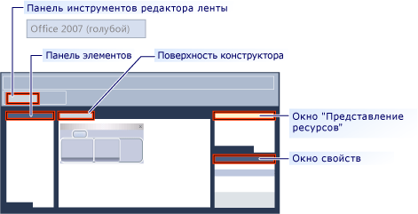

# Конструктор лент (MFC)
[!INCLUDE[vs2017banner](../assembler/inline/includes/vs2017banner.md)]

Конструктор лент позволяет создавать и настраивать ленту в приложениях MFC.  Лента — это элемент пользовательского интерфейса \(UI\), который объединяет команды в логические группы.  Эти группы отображаются на отдельных вкладках ленты в верхней части окна.  Лента заменяет меню и панели инструментов.  Лента может значительно повысить удобство использования приложения.  Дополнительные сведения см. в разделе [Ленты](http://go.microsoft.com/fwlink/?LinkId=129233).  На следующем рисунке показана лента.  
  
   
  
 В более ранних версиях Visual Studio ленты создавались в коде, который использует классы ленты MFC, такие как [CMFCRibbonBar Class](../mfc/reference/cmfcribbonbar-class.md).  В [!INCLUDE[vs_dev10_long](../build/includes/vs_dev10_long_md.md)] конструктор лент предоставляет альтернативный метод создания лент. Во\-первых, создайте и настройте ленту как ресурс.  Затем загрузите ресурс ленты из кода в приложение MFC.  Можно даже использовать ресурсы ленты и классы ленты MFC вместе.  Например, можно создать ресурс ленты и программно добавлять дополнительные элементы в нее во время выполнения.  
  
## Основные сведения о конструкторе лент  
 Конструктор лент создает и сохраняет ленты как ресурсы.  При создании ресурса ленты конструктор лент выполняет следующие три действия.  
  
-   Добавляет запись в скрипт определения ресурсов проекта \(\*.rc\).  В следующем примере `IDR_RIBBON` — уникальное имя, идентифицирующее ресурс ленты, `RT_RIBBON_XML` — тип ресурса, а `ribbon.mfcribbon-ms` — имя файла ресурсов.  
  
    ```  
    IDR_RIBBON             RT_RIBBON_XML                      "res\\ribbon.mfcribbon-ms"  
    ```  
  
-   Добавляет определения идентификаторов команд в файл resource.h.  
  
    ```  
    #define IDR_RIBBON            307  
    ```  
  
-   Создает файл ресурсов ленты \(\*.mfcribbon\-ms\), который содержит XML\-код, определяющий кнопки, элементы управления и атрибуты ленты.  Изменения в конструкторе ленты на ленту сохраняются в файле ресурсов как XML.  В следующем примере кода показана часть содержимого файла \*.mfcribbon\-ms:  
  
    ```  
    <RIBBON_BAR>  
      <ELEMENT_NAME>RibbonBar</ELEMENT_NAME>  
      <IMAGE>  
        <ID>  
          <NAME>IDB_BUTTONS</NAME>  
          <VALUE>113</VALUE>  
        </ID> …  
    ```  
  
 Чтобы использовать ресурс ленты в приложении MFC, загрузите его, вызвав [CMFCRibbonBar::LoadFromResource](../Topic/CMFCRibbonBar::LoadFromResource.md).  
  
## Создание ленты с помощью конструктора лент  
 Ниже описаны два способа для добавления ресурса ленты в проект MFC.  
  
-   Создайте приложение MFC и настройте мастер проектов MFC для создания ленты.  Дополнительные сведения см. в разделе [Пошаговое руководство. Создание приложения ленты с помощью MFC](../mfc/walkthrough-creating-a-ribbon-application-by-using-mfc.md).  
  
-   Создайте ресурс ленты в существующем проекте MFC и загрузите его.  Дополнительные сведения см. в разделе [Пошаговое руководство. Обновление приложения MFC Scribble \(часть 1\)](../mfc/walkthrough-updating-the-mfc-scribble-application-part-1.md).  
  
 Если в проекте уже есть вручную закодированная лента, MFC предоставляет функции, которые можно использовать для преобразования существующей ленты в ресурс ленты.  Дополнительные сведения см. в разделе [Практическое руководство. Преобразование существующей ленты MFC в ресурс ленты](../mfc/how-to-convert-an-existing-mfc-ribbon-to-a-ribbon-resource.md).  
  
> [!NOTE]
>  Ленты не могут быть созданы в приложениях на базе диалоговых окон.  Дополнительные сведения см. в разделе [Тип приложения, мастер приложений MFC](../Topic/Application%20Type,%20MFC%20Application%20Wizard.md).  
  
## Настройка лент  
 Чтобы открыть ленту в конструкторе лент, дважды щелкните ресурс ленты в представлении ресурсов.  В конструкторе можно добавлять, удалять и настраивать элементы на ленте, кнопку «Приложение» и панель инструментов быстрого доступа.  Вы также можете привязать события, например события нажатия кнопки и события меню, к методу в приложении.  
  
 На следующем рисунке показаны различные компоненты конструктора лент.  
  
   
  
-   **Панель элементов** содержит элементы управления, которые можно перетаскивать в область конструктора.  
  
-   **Поверхность конструктора** содержит визуальное представление ресурса ленты.  
  
-   **Окно свойств** содержит список атрибутов элемента, выбранного на поверхности конструктора.  
  
-   **Окно представления ресурсов** отображает ресурсы, содержащие ресурсы ленты, в проекте.  
  
-   **Панель инструментов редактора ленты** содержит команды, которые позволяют просмотреть ленту и изменить ее визуальную тему.  
  
 В следующих разделах описаны способы использования функций в конструкторе лент.  
  
-   [Практическое руководство. Настройка кнопки приложения](../mfc/how-to-customize-the-application-button.md)  
  
-   [Практическое руководство. Настройка панели быстрого доступа](../mfc/how-to-customize-the-quick-access-toolbar.md)  
  
-   [Практическое руководство. Добавление элементов управления и обработчиков событий ленты](../mfc/how-to-add-ribbon-controls-and-event-handlers.md)  
  
-   [Практическое руководство. Загрузка ресурса ленты из приложения MFC](../mfc/how-to-load-a-ribbon-resource-from-an-mfc-application.md)  
  
## Определения элементов ленты  
   
  
-   **Кнопка «Приложение»:** кнопка, которая появляется в левом верхнем углу ленты.  Кнопка «Приложение» заменяет меню «Файл» и отображается, даже если лента свернута.  При нажатии этой кнопки отображается меню, которое содержит список команд.  
  
-   **Панель инструментов быстрого доступа:** небольшая настраиваемая панель инструментов, в которой отображаются часто используемые команды.  
  
-   **Категория**: логическая группа, которая представляет содержимое вкладки ленты.  
  
-   **Кнопка «Категория по умолчанию»:** кнопка, которая отображается, когда лента свернута.  При нажатии кнопки категория снова появляется как меню.  
  
-   **Панель:** область ленты, в которой отображается группа связанных элементов управления.  Каждая категория ленты содержит одну или несколько панелей ленты.  
  
-   **Элементы ленты:** элементы управления в панелях, например кнопки и поля со списком.  Описание различных элементов, которые можно разместить на ленте, см. в разделе [Пример RibbonGadgets: приложение с гаджетами на ленте](../top/visual-cpp-samples.md).  
  
## См. также  
 [Элементы пользовательского интерфейса](../mfc/user-interface-elements-mfc.md)   
 [Working with Resource Files](../mfc/working-with-resource-files.md)