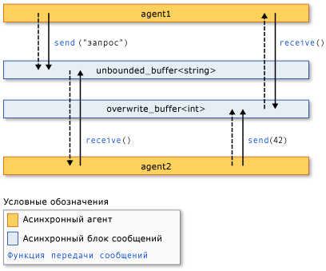

# библиотеку асинхронных агентов
[!INCLUDE[vs2017banner](../../assembler/inline/includes/vs2017banner.md)]

Библиотека асинхронных агентов (или просто *Библиотека агентов*) предоставляет модель программирования, которая позволяет повысить надежность разработки приложений с поддержкой параллелизма. Библиотека агентов — это библиотека шаблонов C++, обеспечивающую модель программирования на основе субъектов и в процессе передачи сообщений для недетализированного потока данных и задач по конвейеризации. Библиотека агентов основана на компонентах планирования и ресурсов управления среды выполнения с параллелизмом.  
  
## <a name="programming-model"></a>Модель программирования  
 Библиотека агентов предоставляет альтернативы общему состоянию, позволяя подключать изолированные компоненты через модель асинхронной передачи, которая основана на потоке данных, а не потока управления. *Поток данных* ссылается программирования доступна модель, в которой вычисления выполняются, когда все необходимые данные; *поток управления* ссылается на модель программирования, в которой вычисления выполняются в предопределенном порядке.  
  
 Модель программирования потоков данных связана с понятием *передачи сообщений*, где независимые компоненты программы взаимодействуют друг с другом посредством отправки сообщений.  
  
 Библиотека агентов состоит из трех компонентов: *асинхронных агентов*, *асинхронные блоки сообщений*, и *функции передачи сообщений*. Агенты поддерживают состояние и используют блоки сообщений и функции передачи сообщений для взаимодействия друг с другом и с внешними компонентами. Функции передачи сообщений позволяют агентам отправлять и получать сообщения от внешних компонентов. Асинхронные блоки сообщений содержат сообщения и позволяют агентам взаимодействовать синхронизированной.  
  
 Ниже показано взаимодействие двух агентов используйте блоки сообщений и функции передачи сообщений для взаимодействия. На этом рисунке `agent1` отправляет сообщение `agent2` с помощью [concurrency::send](../Topic/send%20Function.md) функции и [concurrency::unbounded_buffer](../Topic/unbounded_buffer%20Class.md) объекта. `agent2` использует [concurrency::receive](../Topic/receive%20Function.md) функция для чтения сообщения. `agent2` использует тот же метод для отправки сообщения к `agent1`. Пунктирными стрелками обозначается поток данных между агентами. Сплошные стрелки соединяют агенты с блоками сообщений, которые они записи или чтения из.  
  
   
  
 Пример кода, который реализует на этом рисунке показан далее в этом разделе.  
  
 Модель программирования на основе агентов имеет несколько преимуществ по сравнению с другими параллелизма и синхронизации механизмы, например, события. Одно из преимуществ — что используя передачу сообщений для передачи изменений состояния между объектами, можно изолировать доступ к общим ресурсам и повысить масштабируемость системы. Преимущество передачи сообщений состоит в том, что она связывает синхронизацию с данными, а не к внешним объектом синхронизации. Это упрощает передачу данных между компонентами и позволяет избежать ошибок программирования в приложениях.  
  
## <a name="when-to-use-the-agents-library"></a>Когда следует использовать библиотеку агентов  
 Используйте библиотеку агентов, если имеется несколько операций, которые должны асинхронно взаимодействовать друг с другом. Блоки сообщений и функции передачи сообщений позволяют записывать параллельные приложения, не требуя механизмов синхронизации, такие как блокировки. Это позволяет сосредоточиться на логике приложения.  
  
 Модель программирования на основе агентов часто используется для создания *конвейеры данных* или *сети*. Конвейер данных — это ряд компонентов, каждый из которых выполняет конкретную задачу в более крупной цели. Каждый компонент конвейера потока данных выполняет работу, когда он получает сообщение от другого компонента. Результат этой работы передается другим компонентам конвейера или сети. Компоненты могут использовать более специфические функции параллелизма из других библиотек, например, [библиотеки параллельных шаблонов (PPL)](../../parallel/concrt/parallel-patterns-library-ppl.md).  
  
## <a name="example"></a>Пример  
 В следующем примере реализуется на рисунке выше в этом разделе.  
  
 [!code-cpp[concrt-basic-agents#1](../../parallel/concrt/codesnippet/CPP/asynchronous-agents-library_1.cpp)]  
  
 В этом примере выводятся следующие данные:  
  
```Output  
agent1: sending request...  
agent2: received 'request'.  
agent2: sending response...  
agent1: received '42'.  
```  
  
 Ниже описываются функциональные возможности, используемые в этом примере.  
  
## <a name="related-topics"></a>Связанные разделы  
 [Асинхронные агенты](../../parallel/concrt/asynchronous-agents.md)  
 Описывает роль асинхронных агентов в решении более крупных вычислительных задач.  
  
 [Асинхронные блоки сообщений](../../parallel/concrt/asynchronous-message-blocks.md)  
 Описывает различные типы блоков сообщений, предоставляемых библиотекой агентов.  
  
 [Функции передачи сообщений](../../parallel/concrt/message-passing-functions.md)  
 Описывает различные процедуры передачи сообщений, предоставляемых библиотекой агентов.  
  
 [Практическое руководство: реализация различных шаблонов производитель получатель](../../parallel/concrt/how-to-implement-various-producer-consumer-patterns.md)  
 Описание способов реализации шаблона производитель получатель в приложении.  
  
 [Практическое руководство: предоставление рабочих функций классам call и transformer](../../parallel/concrt/how-to-provide-work-functions-to-the-call-and-transformer-classes.md)  
 Приводится несколько способов предоставления рабочих функций [concurrency::call](../../parallel/concrt/reference/call-class.md) и [concurrency::transformer](../../parallel/concrt/reference/transformer-class.md) классы.  
  
 [Практическое руководство: использование преобразователя в конвейере данных](../../parallel/concrt/how-to-use-transformer-in-a-data-pipeline.md)  
 Показано, как использовать [concurrency::transformer](../../parallel/concrt/reference/transformer-class.md) в конвейере данных.  
  
 [Практическое руководство: выбор среди завершенных задач](../../parallel/concrt/how-to-select-among-completed-tasks.md)  
 Показано, как использовать [concurrency::choice](../../parallel/concrt/reference/choice-class.md) и [concurrency::join](../Topic/join%20Class.md) классы, чтобы выбрать первую задачу для завершения алгоритма поиска.  
  
 [Практическое руководство: передавать сообщения через постоянные интервалы времени](../../parallel/concrt/how-to-send-a-message-at-a-regular-interval.md)  
 Показано, как использовать [concurrency::timer](../../parallel/concrt/reference/timer-class.md) класс для отправки сообщений через определенные интервалы.  
  
 [Практическое руководство: использование фильтра блока сообщений](../../parallel/concrt/how-to-use-a-message-block-filter.md)  
 Показано, как использовать фильтр, чтобы асинхронный блок сообщений принимать или отклонять сообщения.  
  
 [Библиотека параллельных шаблонов (PPL)](../../parallel/concrt/parallel-patterns-library-ppl.md)  
 В данной статье описывается использование в приложениях различных параллельных шаблонов, например параллельных алгоритмов.  
  
 [Среда выполнения с параллелизмом](../../parallel/concrt/concurrency-runtime.md)  
 Описывает среду выполнения с параллелизмом, которая упрощает процесс параллельного программирования и содержит ссылки на соответствующие разделы.

