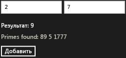

# Пошаговое руководство. Создание базового компонента среды выполнения Windows с использованием WRL
В этом документе показано, как использовать среды выполнения C++ шаблон библиотеки Windows (WRL) для создания базового компонента среды выполнения Windows. Компонент складывает 2 числа и вызывает событие, если результат — простое число. В этом документе также демонстрируется использование компонента из приложения универсальной платформы Windows, использующего JavaScript.  
  
## Предварительные требования  
  
-   Опыт работы с [среды выполнения Windows](http://msdn.microsoft.com/library/windows/apps/br211377.aspx).  
  
-   опыт работы с моделью COM;  
  
### Для создания базового компонента среды выполнения Windows, который добавляет два числа  
  
1.  Создайте в Visual Studio, Visual C++ `WRLClassLibrary` проекта. Документ [шаблон проекта библиотеки классов](../windows/wrl-class-library-project-template.md) описывает, как загрузить шаблон. Задайте для проекта имя `Contoso`.  
  
2.  В файлах Contoso.cpp и Contoso.idl замените все вхождения "WinRTClass" на "Calculator".  
  
3.  В файле Contoso.idl добавьте метод `Add` в интерфейс `ICalculator`.  
  
     [!code-cpp[wrl-basic-component#1](../windows/codesnippet/CPP/walkthrough-creating-a-basic-windows-runtime-component-using-wrl_1.idl)]  
  
4.  В файле Contoso.cpp в секцию `Add` класса `public` добавьте метод `Calculator`.  
  
     [!code-cpp[wrl-basic-component#2](../windows/codesnippet/CPP/walkthrough-creating-a-basic-windows-runtime-component-using-wrl_2.cpp)]  
  
    > [!IMPORTANT]
    >  Поскольку создается компонент модели COM, необходимо использовать соглашение о вызовах `__stdcall`.  
  
     Рекомендуется использовать `_Out_` и другие заметки на языке заметок к исходному коду (SAL), чтобы описать, как функция использует эти параметры. Заметки на языке SAL также описывают возвращаемые значения. Заметки SAL совместно с [средство анализа кода C/C++](/visualstudio/code-quality/code-analysis-for-c-cpp-overview) для обнаружения возможных ошибок в C и C++ исходный код. Наиболее распространенные ошибки обнаруживаемые этим инструментом — переполнение буфера, неинициализированная память, разыменование пустых указателей, а также утечка памяти и ресурсов.  
  
### Использование компонента из приложения универсальной платформы Windows, использующего JavaScript  
  
1.  В Visual Studio, добавьте новый JavaScript `Blank App` проекта `Contoso` решения. Задайте для проекта имя `CalculatorJS`.  
  
2.  В `CalculatorJS` проекта, добавьте ссылку на `Contoso` проекта.  
  
3.  В файле default.html замените раздел `body` этими элементами пользовательского интерфейса:  
  
     [!code-html[wrl-basic-component#3](../windows/codesnippet/Html/walkthrough-creating-a-basic-windows-runtime-component-using-wrl_3.html)]  
  
4.  В файле default.js реализуйте функцию `OnClick`.  
  
     [!code-javascript[wrl-basic-component#4](../windows/codesnippet/JavaScript/walkthrough-creating-a-basic-windows-runtime-component-using-wrl_4.js)]  
  
    > [!NOTE]
    >  В JavaScript имена методов начинаются с буквы в нижнем регистре в соответствии со стандартным положением об именовании.  
  
### Добавление события, вызываемого при вычислении простого числа  
  
1.  В файле Contoso.idl перед объявлением `ICalculator` определите тип делегата `PrimeNumberEvent`, который предоставляет аргумент `int`.  
  
     [!code-cpp[wrl-basic-component#5](../windows/codesnippet/CPP/walkthrough-creating-a-basic-windows-runtime-component-using-wrl_5.idl)]  
  
     Если используется ключевое слово `delegate`, компилятор MIDL создает интерфейс, содержащий метод `Invoke`, который совпадает с сигнатурой этого делегата. В этом примере созданный файл Contoso_h.h определяет интерфейс `IPrimeNumberEvent`, который используется далее в этой процедуре.  
  
     [!code-cpp[wrl-basic-component#13](../windows/codesnippet/CPP/walkthrough-creating-a-basic-windows-runtime-component-using-wrl_6.cpp)]  
  
2.  В интерфейсе `ICalculator` определите событие `PrimeNumberFound`. Атрибуты `eventadd` и `eventremove` указывают, что объект-получатель интерфейса `ICalculator` может как подписаться, так и отказаться от подписки на это событие.  
  
     [!code-cpp[wrl-basic-component#6](../windows/codesnippet/CPP/walkthrough-creating-a-basic-windows-runtime-component-using-wrl_7.idl)]  
  
3.  Добавьте в Contoso.cpp `private` [Microsoft::WRL::EventSource](../windows/eventsource-class.md) переменной-члена для управления подписчики на события и вызывается обработчик события.  
  
     [!code-cpp[wrl-basic-component#7](../windows/codesnippet/CPP/walkthrough-creating-a-basic-windows-runtime-component-using-wrl_8.cpp)]  
  
4.  В файле Contoso.cpp реализуйте методы `add_PrimeNumberFound` и `remove_PrimeNumberFound`.  
  
     [!code-cpp[wrl-basic-component#8](../windows/codesnippet/CPP/walkthrough-creating-a-basic-windows-runtime-component-using-wrl_9.cpp)]  
  
### Вызов события при вычислении простого числа  
  
1.  В файле Contoso.cpp в секцию `IsPrime` класса `private` добавьте метод `Calculator`.  
  
     [!code-cpp[wrl-basic-component#12](../windows/codesnippet/CPP/walkthrough-creating-a-basic-windows-runtime-component-using-wrl_10.cpp)]  
  
2.  Изменить `Calculator` `Add` метод, вызываемый [Microsoft::WRL::EventSource::InvokeAll](../windows/eventsource-invokeall-method.md) метод при вычислении простого числа.  
  
     [!code-cpp[wrl-basic-component#11](../windows/codesnippet/CPP/walkthrough-creating-a-basic-windows-runtime-component-using-wrl_11.cpp)]  
  
### Обработка события в коде JavaScript  
  
1.  В файле default.html измените раздел `body`, чтобы добавить текстовую область, содержащую простые числа.  
  
     [!code-html[wrl-basic-component#9](../windows/codesnippet/Html/walkthrough-creating-a-basic-windows-runtime-component-using-wrl_12.html)]  
  
2.  В файле default.js измените функцию `Add` для обработки события `PrimeNumberFound`. Обработчик события добавляет простое число в текстовую область, определенную на предыдущем шаге.  
  
     [!code-javascript[wrl-basic-component#10](../windows/codesnippet/JavaScript/walkthrough-creating-a-basic-windows-runtime-component-using-wrl_13.js)]  
  
    > [!NOTE]
    >  В JavaScript имена событий начинаются с буквы в нижнем регистре и предваряются текстом "on" в соответствии со стандартным положением об именовании.  
  
 На следующем рисунке показано пример простого приложения "Калькулятор".  
  
   
  
## Следующие шаги  
  
## См. также  
 [Библиотека шаблонов C++ среды выполнения Windows (WRL)](../windows/windows-runtime-cpp-template-library-wrl.md)   
 [Шаблон проекта библиотеки классов](../windows/wrl-class-library-project-template.md)   
 [Средство анализа кода C/C++](/visualstudio/code-quality/code-analysis-for-c-cpp-overview)