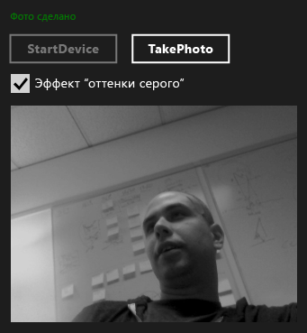

# <a name="walkthrough-creating-a-windows-store-app-using-wrl-and-media-foundation"></a>Пошаговое руководство. Создание приложения для Магазина Windows с использованием WRL и Media Foundation
Использование среды выполнения C++ шаблон библиотеки Windows (WRL) для создания приложения универсальной платформы Windows, который использует [Microsoft Media Foundation](http://msdn.microsoft.com/library/windows/apps/ms694197).  
  
 В этом примере создается пользовательский объект Media Foundation, который применяет эффект "оттенки серого" к изображениям, полученным с веб-камеры. Приложение использует C++ для определения пользовательского преобразования и C# для использования компонента и выполнения преобразования захваченного изображения.  
  
> [!NOTE]
>  Чтобы воспользоваться пользовательским компонентом преобразования вместо C# можно также использовать JavaScript, Visual Basic или C++.  
  

 В большинстве случаев можно использовать C + +/ CX для создания среды выполнения Windows). Однако иногда необходимо использовать WRL. Например при создании медиа-расширения для Microsoft Media Foundation необходимо создать компонент, реализующий интерфейсы COM и среды выполнения Windows. Поскольку C + +/ CX можно создавать только объекты среды выполнения Windows, для создания медиа-расширения необходимо использовать WRL, так как она позволяет реализовывать интерфейсы COM и среды выполнения Windows.  

  
> [!NOTE]
>  Хотя этот пример кода является объемным, он показывает минимум, необходимый для создания полезных преобразований Media Foundation. Его можно использовать в качестве отправной точки для собственного пользовательского преобразования. Этот пример взят из [медиарасширений](http://code.msdn.microsoft.com/windowsapps/Media-extensions-sample-7b466096), медиарасширения для применения эффектов к видео, декодирования видео и создания обработчиков схем, производящих медиапотоки.  
  
## <a name="prerequisites"></a>Предварительные требования  
  
-   Опыт работы с [среды выполнения Windows](http://msdn.microsoft.com/library/windows/apps/br211377.aspx).  
  
-   опыт работы с моделью COM;  
  
-   веб-камера.  
  
## <a name="key-points"></a>Ключевые моменты  
  
-   Для создания пользовательского компонента Media Foundation используйте файл определения языка MIDL, чтобы определить и реализовать интерфейс, а затем сделать его активируемым из других компонентов.  
  
-   `namespace` И `runtimeclass` атрибуты и `NTDDI_WIN8` [версии](http://msdn.microsoft.com/en-us/66ac5cf3-2230-44fd-aaf6-8013e4a4ae81) атрибута являются важными частями определения компонента Media Foundation, который использует WRL MIDL.  
  
-   [Microsoft::wrl:: runtimeclass](../windows/runtimeclass-class.md) является базовым классом для пользовательского компонента Media Foundation. [Microsoft::WRL::RuntimeClassType::WinRtClassicComMix](../windows/runtimeclasstype-enumeration.md) значение перечисления, которое передается как аргумент шаблона, помечает класс для использования в качестве класса среды выполнения Windows, а также как классического COM-класса среды выполнения.  
  
-   [InspectableClass](../windows/inspectableclass-macro.md) макрос реализует базовую функциональность модели COM, такую как подсчет ссылок и `QueryInterface` метод и задает имя класса среды выполнения и уровень доверия.  
  
-   Использовать Microsoft::WRL::[модуль класса](https://www.microsoftonedoc.com/#/organizations/e6f6a65cf14f462597b64ac058dbe1d0/projects/3fedad16-eaf1-41a6-8f96-0c1949c68f32/containers/a3daf831-1c5f-4bbe-964d-503870caf874/tocpaths/b4acf5de-2f4c-4c8b-b5ff-9140d023ecbe/locales/en-US) для реализации функций точки входа DLL, таких как [DllGetActivationFactory](http://msdn.microsoft.com/library/br205771.aspx), [DllCanUnloadNow](http://msdn.microsoft.com/library/windows/desktop/ms690368\(v=vs.85\).aspx), и [ DllGetClassObject](http://msdn.microsoft.com/library/windows/desktop/ms680760\(v=vs.85\).aspx).  
  
-   Необходимо установить связь между компонентом DLL и runtimeobject.lib. Также укажите [/WINMD](../cppcx/compiler-and-linker-options-c-cx.md) в строке компоновщика для создания метаданных Windows.  
  
-   Используйте ссылки проекта, чтобы сделать доступным для приложений универсальной платформы Windows компонентов WRL.  
  
### <a name="to-use-the-wrl-to-create-the-media-foundation-grayscale-transform-component"></a>Чтобы использовать WRL для создания серого Media Foundation преобразовать компонент  
  
1.  В Visual Studio создайте **пустое решение** проекта. Задайте имя проекта, например, `MediaCapture`.  
  
2.  Добавить **DLL (приложения для магазина Windows)** проекта в решение. Задайте имя проекта, например, `GrayscaleTransform`.  
  
3.  Добавить **Midl файл (.idl)** файл в проект. Имя файла, например, `GrayscaleTransform.idl`.  
  
4.  Добавьте в файл GrayscaleTransform.idl следующий код:  
  
     [!code-cpp[wrl-media-capture#1](../windows/codesnippet/CPP/walkthrough-creating-a-windows-store-app-using-wrl-and-media-foundation_1.idl)]  
  
5.  Замените содержимое файла pch.h следующим кодом:  
  
     [!code-cpp[wrl-media-capture#2](../windows/codesnippet/CPP/walkthrough-creating-a-windows-store-app-using-wrl-and-media-foundation_2.h)]  
  
6.  Добавьте в проект новый файл заголовок, назовите его `BufferLock.h`, а затем добавьте следующий код:  
  
     [!code-cpp[wrl-media-capture#3](../windows/codesnippet/CPP/walkthrough-creating-a-windows-store-app-using-wrl-and-media-foundation_3.h)]  
  
7.  Файл GrayscaleTransform.h не используется в данном примере. Его можно удалить из проекта при необходимости.  
  
8.  Замените содержимое файла GrayscaleTransform.cpp следующим кодом:  
  
     [!code-cpp[wrl-media-capture#4](../windows/codesnippet/CPP/walkthrough-creating-a-windows-store-app-using-wrl-and-media-foundation_4.cpp)]  
  
9. Добавьте в проект новый файл определения модуля, назовите его `GrayscaleTransform.def`, а затем добавьте следующий код:  
  
   ```
   EXPORTS
       DllCanUnloadNow                     PRIVATE
       DllGetActivationFactory             PRIVATE
       DllGetClassObject                   PRIVATE
   ```   
  
10. Замените содержимое файла dllmain.cpp следующим кодом:  
  
     [!code-cpp[wrl-media-capture#6](../windows/codesnippet/CPP/walkthrough-creating-a-windows-store-app-using-wrl-and-media-foundation_6.cpp)]  
  
11. В проекте **страницы свойств** диалоговом окне установите следующие **компоновщика** свойства.  
  
    1.  В разделе **ввода**, для **файл определения модуля**, укажите `GrayScaleTransform.def`.  
  
    2.  Также в разделе **ввода**, добавьте `runtimeobject.lib`, `mfuuid.lib`, и `mfplatf.lib` для **Дополнительные зависимости** свойство.  
  
    3.  В разделе **метаданных Windows**, задайте **создавать метаданные Windows** для **Да (/ WINMD)**.  
  
### <a name="to-use-the-wrl-the-custom-media-foundation-component-from-a-c-app"></a>Для использования пользовательского компонента Media Foundation из приложения C# WRL  
  
1.  Добавьте новый **C# пустое приложение (XAML)** проекта `MediaCapture` решения. Задайте имя проекта, например, `MediaCapture`.  
  
2.  В **MediaCapture** проекта, добавьте ссылку на `GrayscaleTransform` проекта. Дополнительные сведения см. в разделе [как: Добавление и удаление ссылок с помощью диспетчера ссылок](/visualstudio/ide/how-to-add-or-remove-references-by-using-the-reference-manager).  
  
3.  В Package.appxmanifest на **возможности** выберите **микрофон** и **веб-камере**. Обе возможности необходимы для получения фотографий с веб-камеры.  
  
4.  В MainPage.xaml добавьте следующий код в корень [сетки](http://msdn.microsoft.com/library/windows/apps/xaml/windows.ui.xaml.controls.grid.aspx) элемента:  
  
     [!code-xml[wrl-media-capture#7](../windows/codesnippet/Xaml/walkthrough-creating-a-windows-store-app-using-wrl-and-media-foundation_7.xaml)]  
  
5.  Замените содержимое файла MainPage.xaml.cs следующим кодом:  
  
     [!code-cs[wrl-media-capture#8](../windows/codesnippet/CSharp/walkthrough-creating-a-windows-store-app-using-wrl-and-media-foundation_8.cs)]  
  
 На следующем рисунке показано приложение MediaCapture.  
  
   
  
## <a name="next-steps"></a>Следующие шаги  
 Пример показывает способ записи фотографий (по одной) с веб-камеры по умолчанию. [Медиарасширений](http://code.msdn.microsoft.com/windowsapps/Media-extensions-sample-7b466096) делается больше. В нем показано, как выполнить перебор веб-камер и работать с локальными обработчиками схем, а также демонстрируются дополнительные медиа-эффекты, работающие как на отдельных фотографиях, так и на потоках видео.  
  
## <a name="see-also"></a>См. также  
 [Библиотека шаблонов C++ среды выполнения Windows (WRL)](../windows/windows-runtime-cpp-template-library-wrl.md)   
 [Microsoft Media Foundation](http://msdn.microsoft.com/library/windows/apps/ms694197)   
 [Пример расширений мультимедиа](http://code.msdn.microsoft.com/windowsapps/Media-extensions-sample-7b466096)